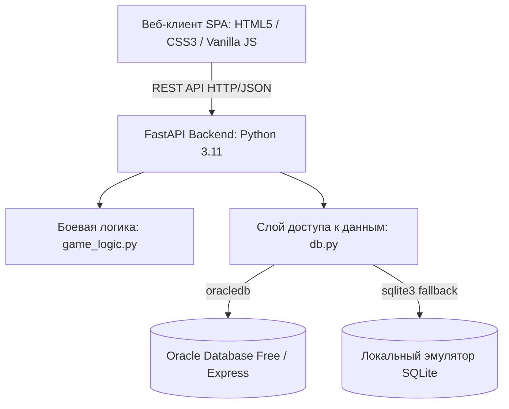

# 📚 Полная техническая документация: «Покемон-баттл RPG 2.0»

Многопользовательская пошаговая ролевая игра (RPG) с 4 стихиями, системой аутентификации на основе ролей СУБД Oracle (`GAME_PLAYER_ROLE`), прокачкой, ловлей, эволюцией покемонов, рейтинговыми сезонами Elo, пасхалкой «Таблица умножения» и полной поддержкой запуска как в контейнерах Docker, так и вручную без Docker.

---

## 📑 Содержание

1. [Обзор архитектуры системы](#1-обзор-архитектуры-системы)
2. [Технологический стек и версии компонентов](#2-технологический-стек-и-версии-компонентов)
3. [Руководство по запуску приложения](#3-руководство-по-запуску-приложения)
   - [Способ 1: Автоматический запуск через Docker Compose (Рекомендуемый)](#способ-1-автоматический-запуск-через-docker-compose)
   - [Способ 2: Ручной запуск без использования Docker](#способ-2-ручной-запуск-без-использования-docker)
4. [Проектирование и безопасность базы данных](#4-проектирование-и-безопасность-базы-данных)
   - [Схема таблиц (3NF)](#схема-таблиц-3nf)
   - [Безопасность и роль GAME_PLAYER_ROLE](#безопасность-и-роль-game_player_role)
5. [Игровая механика и математические формулы](#5-игровая-механика-и-математические-формулы)
   - [Матрица 4 стихий](#матрица-4-стихий)
   - [Формулы попадания, крита и урона](#формулы-попадания-крита-и-урона)
   - [Расчёт рейтинга Elo и дивизионы](#расчёт-рейтинга-elo-и-дивизионы)
   - [Ловля и древо эволюции существ](#ловля-и-древо-эволюции-существ)
   - [Досрочное завершение боя (Сдача)](#досрочное-завершение-боя-сдача)
   - [Пасхалка «Таблица умножения»](#пасхалка-таблица-умножения)
6. [Спецификация REST API](#6-спецификация-rest-api)
7. [Пользовательский веб-интерфейс](#7-пользовательский-веб-интерфейс)
8. [Тестирование и верификация](#8-тестирование-и-верификация)
9. [Устранение неполадок (FAQ)](#9-устранение-неполадок-faq)

---

## 1. Обзор архитектуры системы

Приложение спроектировано по модульной трёхзвенной архитектуре с четким разделением ответственности:



- **Frontend (Клиент)**: Одностраничное веб-приложение (SPA) без тяжелых сторонних фреймворков. Написано на Vanilla JavaScript (ES6+) и CSS3 с использованием дизайн-системы неонового темного фэнтези, CSS-переменных, Flexbox/Grid и полинга состояния арены.
- **Backend (Сервер API)**: Асинхронный сервис на базе **FastAPI** и ASGI-сервера **Uvicorn**, реализующий RESTful эндпоинты, валидацию Pydantic, управление сессиями боев и аудит ходов.
- **Database Engine (СУБД)**: Двухуровневый адаптер:
  1. *Основной режим*: СУБД **Oracle Database** с проверкой ролевой модели безопасности `GAME_PLAYER_ROLE`.
  2. *Автономный режим (Fallback)*: Встроенный движок **SQLite**, зеркалирующий схему и ограничения Oracle для возможности мгновенной проверки без тяжелых СУБД.

---

## 2. Технологический стек и версии компонентов

| Компонент | Назначение | Используемая версия | Лицензия |
|---|---|---|---|
| **Python** | Основной язык серверной логики | `3.11+` (поддержка 3.10 - 3.12) | PSF License |
| **FastAPI** | Высокопроизводительный асинхронный веб-фреймворк | `0.110.0+` | MIT |
| **Uvicorn** | ASGI веб-сервер с поддержкой горячей перезагрузки | `0.28.0+` | BSD |
| **Pydantic** | Строгая валидация схем запросов и ответов | `2.6.0+` | MIT |
| **python-oracledb** | Официальный драйвер подключения к Oracle DB (Thin/Thick) | `2.1.0+` | Apache 2.0 / UPL |
| **Oracle Database** | Реляционная СУБД промышленного уровня | `23c Free / 21c XE` | Oracle Free Use |
| **SQLite** | Встроенный SQL-эмулятор для автономной работы | `3.40+` | Public Domain |
| **Docker** | Контейнеризация приложения | `24.0+` | Apache 2.0 |
| **Docker Compose** | Оркестрация мультиконтейнерного стека (`app` + `oracle-db`) | `v2.20+` | Apache 2.0 |
| **Pytest** | Фреймворк автоматизированного модульного тестирования | `8.0.0+` | MIT |
| **Frontend Core** | Пользовательский интерфейс | HTML5, CSS3, ES6+ JavaScript | Open Source |

---

## 3. Руководство по запуску приложения

### Способ 1: Автоматический запуск через Docker Compose

Рекомендуемый способ развёртывания полного промышленного стека с СУБД Oracle Database Free и веб-приложением.

#### Требования:
- Установленный **Docker Desktop** (Windows/macOS) или **Docker Engine + Docker Compose** (Linux).
- Свободные порты: `8000` (веб-интерфейс) и `1521` (Oracle DB).
- Минимум 4 ГБ свободной оперативной памяти для контейнера СУБД.

#### Команда запуска:
Выполните в корневой директории проекта:
```bash
docker compose up --build
```

#### Что происходит автоматически:
1. Запускается контейнер `pokemon-oracle-db` на базе официального образа `gvenzl/oracle-free:latest`.
2. При первом старте Oracle выполняет скрипты инициализации из каталога `/db`:
   - `01_schema.sql` — создание таблиц, внешних ключей и индексов.
   - `02_roles_and_users.sql` — создание роли `GAME_PLAYER_ROLE` и тестовых аккаунтов `PLAYER1`, `PLAYER2`.
   - `03_seed_data.sql` — наполнение справочников стихий, матрицы урона, 20 шаблонов существ и стартовых команд.
3. Проверяется здоровье контейнера СУБД через `healthcheck.sh`.
4. После перехода Oracle в статус `healthy` запускается контейнер `pokemon-game-app`, поднимающий FastAPI-сервер на порту `8000`.

#### Открытие приложения:
Откройте браузер по адресу: **[http://localhost:8000](http://localhost:8000)**

#### Остановка контейнеров:
```bash
docker compose down
# Для полной очистки с удалением тома данных БД:
docker compose down -v
```

---

### Способ 2: Ручной запуск без использования Docker

Для запуска без установки Docker в проекте предусмотрена специальная автономная папка **`manual_run/`**.

#### Быстрый старт:

- **Windows**: Запустите файл `manual_run\run_windows.bat` (двойным кликом или в командной строке).
- **PowerShell**: Запустите `powershell -ExecutionPolicy Bypass -File manual_run\run_windows.ps1`.
- **Linux / macOS**: Выполните `chmod +x manual_run/run_linux_mac.sh && ./manual_run/run_linux_mac.sh`.

#### Пошаговые команды вручную:

1. **Создание и активация виртуального окружения**:
   ```bash
   # Windows (CMD / PowerShell):
   python -m venv .venv
   .\.venv\Scripts\activate

   # Linux / macOS (Bash):
   python3 -m venv .venv
   source .venv/bin/activate
   ```

2. **Установка зависимостей**:
   ```bash
   pip install -r manual_run/requirements.txt
   ```

3. **Самодиагностика готовности окружения**:
   ```bash
   python manual_run/verify_setup.py
   ```

4. **Запуск веб-сервера**:
   ```bash
   uvicorn backend.main:app --host 127.0.0.1 --port 8000 --reload
   ```

5. **Переход в браузер**:
   Откройте: **[http://localhost:8000](http://localhost:8000)**

---

## 4. Проектирование и безопасность базы данных

### Схема таблиц (3NF)

База данных спроектирована в 3-й нормальной форме, гарантируя целостность связей через внешние ключи (`FOREIGN KEY`) и каскадные правила:

```
[ELEMENTS] (Справочник 4 стихий: FIRE, GRASS, WATER, EARTH)
    │
    ├──< [ELEMENT_ADVANTAGES] (Матрица урона: attacker_element, defender_element, multiplier)
    │
    └──< [CREATURE_TEMPLATES] (Базовые виды существ, статы, unlock_level, evolution_level, evolves_to_id)
            │
            ├──< [PLAYER_CREATURES] (Коллекция тренера: nickname, level, stats, is_in_team)
            │       │
            │       └──< [BATTLE_CREATURES] (Снимки HP и статусов покемонов в бою)
            │
[PLAYERS] (Профиль: логин, пароль, Elo-рейтинг, монеты, ранг сезона, winrate)
    │
    ├──< [PLAYER_INVENTORY] (Количество предметов у игрока) >── [ITEMS] (Справочник предметов/зелий)
    │
    └──< [BATTLES] (Сессии боев 1v1: player1, player2, статус, чей ход, победитель)
            │
            ├──< [BATTLE_CREATURES] (Снимок состава участников боя)
            │
            └──< [BATTLE_TURNS] (Аудит ходов: номер раунда, атака, урон, крит, попадание, сообщение)
```

### Безопасность и роль `GAME_PLAYER_ROLE`

В соответствии с требованиями безопасности к базам данных корпоративного уровня:
1. Создается выделенная роль СУБД:
   ```sql
   CREATE ROLE GAME_PLAYER_ROLE;
   ```
2. Роли выдаются строго минимально необходимые объектные привилегии (`SELECT`, `INSERT`, `UPDATE` к игровым таблицам, без права `DROP` или модификации системных каталогов).
3. При аутентификации игрока через эндпоинт `/api/auth/login` проверяется реальное наличие роли `GAME_PLAYER_ROLE` у пользователя в системном представлении `USER_ROLE_PRIVS`.
4. Для новых тренеров, регистрирующихся через веб-форму, роль назначается автоматически.

---

## 5. Игровая механика и математические формулы

### Матрица 4 стихий

В игре представлена замкнутая тактическая система стихий:

| Атакующая стихия | Обороняющаяся стихия | Множитель урона | Статус эффективности |
|---|---|---|---|
| 🔥 **Огонь** | 🌿 Трава | **x1.5** | Сверхэффективно |
| 🔥 **Огонь** | 💧 Вода | **x0.7** | Слабая атака (сопротивление) |
| 🔥 **Огонь** | ⛰️ Земля | **x1.1** | Небольшой бонус |
| 🌿 **Трава** | 💧 Вода | **x1.5** | Сверхэффективно |
| 🌿 **Трава** | ⛰️ Земля | **x1.4** | Сверхэффективно |
| 🌿 **Трава** | 🔥 Огонь | **x0.7** | Слабая атака |
| 💧 **Вода** | 🔥 Огонь | **x1.5** | Сверхэффективно |
| 💧 **Вода** | ⛰️ Земля | **x1.2** | Эффективно |
| 💧 **Вода** | 🌿 Трава | **x0.7** | Слабая атака |
| ⛰️ **Земля** | 🔥 Огонь | **x1.4** | Сверхэффективно |
| ⛰️ **Земля** | 🌿 Трава | **x0.7** | Слабая атака |
| *Любая стихия* | *Та же стихия* | **x1.0** | Нейтральный урон |

### Формулы попадания, крита и урона

1. **Вероятность попадания (Hit Chance)**:
   $$\text{HitChance} = \max\left(70\%, \; \min\left(98\%, \; 92\% + 0.4 \times (\text{Speed}_{\text{атакующий}} - \text{Speed}_{\text{защитник}})\right)\right)$$
   При промахе урон равен $0$, ход фиксируется с флагом `is_hit = 0`.

2. **Шанс критического удара (Critical Chance)**:
   $$\text{CritChance} = \max\left(8\%, \; \min\left(35\%, \; 12\% + 0.2 \times \text{Speed}_{\text{атакующий}}\right)\right)$$
   Критический удар даёт множитель урона $\text{CritMult} = 1.5$.

3. **Формула итогового урона (Damage)**:
   $$\text{BaseDamage} = \max\left(6, \; 1.55 \times \text{Attack}_{\text{атакующий}} - 0.55 \times \text{Defense}_{\text{защитник}}\right)$$
   $$\text{TotalDamage} = \max\left(1, \; \text{round}\left(\text{BaseDamage} \times \text{ElemMult} \times \text{CritMult} \times \text{Variance}\right)\right)$$
   где $\text{Variance} \in [0.92, \; 1.08]$ — случайная флуктуация силы удара.

### Расчёт рейтинга Elo и дивизионы

Рейтинг каждого игрока инициализируется значением `1000`. После завершения боя:
- Победитель получает: $+25$ Elo, $+120$ EXP, $+60$ монет.
- Проигравший получает: $-20$ Elo (минимум 800), $+35$ утешительного EXP.

**Дивизионы тренеров**:
- 🥉 **BRONZE**: до 1049 Elo
- 🥈 **SILVER**: 1050 – 1149 Elo
- 🥇 **GOLD**: 1150 – 1249 Elo
- 💎 **PLATINUM**: 1250 – 1399 Elo
- 👑 **DIAMOND**: 1400+ Elo

### Ловля и древо эволюции существ

- **Ловля диких покемонов**: Алтарь призыва доступен за 60 заработанных монет. Призывает случайного базового покемона, открытого по текущему уровню игрока.
- **Эволюция**: При достижении требуемого уровня покемона (например, 6-й или 12-й уровень) в интерфейсе редактора загорается кнопка «Эволюционировать ✨». Покемон трансформируется в усиленную форму с новыми спрайтами и увеличенными характеристиками.

### Досрочное завершение боя (Сдача)

Игрок в любой момент активной битвы может нажать **«Сдаться досрочно»**:
- Сдающемуся игроку гарантируется **техническое поражение**: списывается $-25$ Elo, инкрементируется счётчик поражений.
- Сопернику присуждается **победа**: начисляется $+25$ Elo, $+100$ EXP и $+50$ монет.
- В таблицу `BATTLE_TURNS` вносится запись о капитуляции.

### Пасхалка «Таблица умножения»

Секретный тренажёр Академии тренеров:
- Генерирует случайные примеры умножения однозначных чисел ($a \times b$).
- За каждый верный ответ начисляются опыт (EXP), монеты и мгновенный $+1$ уровень всем существам активной команды тренера.

---

## 6. Спецификация REST API

| Метод | Путь эндпоинта | Описание | Тело запроса / Параметры |
|---|---|---|---|
| `GET` | `/api/health` | Проверка статуса сервера и СУБД | — |
| `POST` | `/api/auth/login` | Вход игрока и проверка роли Oracle | `{"username", "password"}` |
| `POST` | `/api/auth/register` | Регистрация нового тренера со стартером | `{"username", "password", "display_name", "starter_template_id"}` |
| `GET` | `/api/player/{id}/profile` | Детальный профиль (уровень, EXP, Elo, ранги) | `player_id` |
| `GET` | `/api/player/{id}/creatures` | Коллекция покемонов игрока | `player_id` |
| `GET` | `/api/player/{id}/inventory` | Инвентарь зелий и предметов | `player_id` |
| `POST` | `/api/player/{id}/creatures/{cid}/update` | Смена клички / состава команды (1-3) | `{"nickname", "is_in_team"}` |
| `POST` | `/api/player/{id}/creatures/{cid}/evolve` | Запуск эволюции покемона | `creature_id` |
| `POST` | `/api/player/{id}/creatures/catch` | Ловля случайного дикого покемона | `player_id` |
| `GET` | `/api/creatures` | Полный каталог существ и цепочек эволюции | — |
| `GET` | `/api/training/math-challenge` | Получение примера на умножение (пасхалка) | — |
| `POST` | `/api/training/math-solve` | Проверка ответа и начисление наград | `{"player_id", "num1", "num2", "answer"}` |
| `GET` | `/api/leaderboard` | Таблица лидеров рейтингового сезона | — |
| `GET` | `/api/battles` | Список открытых PvP-боев в лобби | — |
| `POST` | `/api/battles/create` | Создание нового боя | `{"player_id", "battle_type": "PVP"}` |
| `POST` | `/api/battles/{id}/join` | Подключение второго игрока к сессии | `{"player_id"}` |
| `POST` | `/api/battles/bot` | Мгновенный запуск PvE-боя против ИИ-бота | `{"player_id"}` |
| `GET` | `/api/battles/{id}` | Полный снимок состояния боя и лога ходов | `battle_id` |
| `POST` | `/api/battles/{id}/attack` | Совершение стихийной атаки | `{"actor_player_id", "actor_creature_id", "target_creature_id"}` |
| `POST` | `/api/battles/{id}/use_item` | Использование зелья (тратит ход) | `{"player_id", "item_id", "target_creature_id"}` |
| `POST` | `/api/battles/{id}/surrender` | Досрочная сдача (гарантирует поражение) | `{"player_id"}` |

---

## 7. Пользовательский веб-интерфейс

Интерфейс разделен на логические экраны:
1. **Экран авторизации и регистрации**: быстрая авторизация под `PLAYER1` / `PLAYER2`, создание аккаунта с выбором стартера.
2. **Лобби сражений**: список открытых PvP-комнат и кнопка быстрого матча против ИИ-Бота.
3. **Личный профиль**: индикаторы уровня, интерактивный прогресс-бар EXP, баланс монет, статистика побед/поражений и перечень открываемых покемонов.
4. **Редактор существ и команды**: управление активной тройкой покемонов, переименование, кнопка эволюции.
5. **Алтарь ловли**: витрина поимки диких покемонов за монеты.
6. **Рейтинговый сезон (Leaderboard)**: сводная таблица лидеров с ранговыми значками.
7. **Боевая арена (1v1)**: карточки существ с анимацией полосок HP, подсветка выбранных целей, превью множителя урона, журнал раундов в реальном времени, кнопка капитуляции.
8. **Пасхалка**: интерактивная мини-игра решения таблицы умножения с наградами.

---

## 8. Тестирование и верификация

### Запуск модульных тестов боевой системы:
```bash
pytest tests/test_game_logic.py -v
```

Покрыты сценарии:
- Все возможные пары преимуществ стихийной матрицы (огонь > трава > вода > огонь, земля > огонь).
- Зеркальные бои одной стихии (нейтральный множитель x1.0).
- Корректность формулы урона с учётом брони цели.
- Определение условия победы / поражения команды.
- Обработка граничных состояний (пустой список бойцов).

### Запуск самодиагностики окружения:
```bash
python manual_run/verify_setup.py
```

---

## 9. Устранение неполадок (FAQ)

| Проблема | Причина | Решение |
|---|---|---|
| `docker compose up` завершается с ошибкой `port 1521 already allocated` | На хост-машине уже запущен локальный Oracle или другая служба на порту 1521 | Измените порт в `docker-compose.yml`: `"1522:1521"` |
| В ручном режиме `python: command not found` | Python не установлен или не добавлен в PATH | Установите Python 3.11+, отметив чекбокс "Add to PATH" |
| Ошибка подключения к Oracle при ручном запуске | Сервер Oracle выключен | Никаких действий не требуется: приложение автоматически включит быстрый локальный движок `local_game.db` |
| По ошибке сдался в бою | Была нажата кнопка «Сдаться» и подтверждено диалоговое окно | Зафиксировано поражение, рейтинг снижен на 25 очков; проведите реванш с ботом для восстановления Elo |
